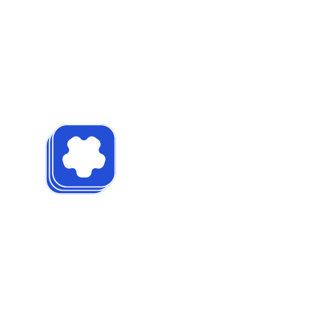
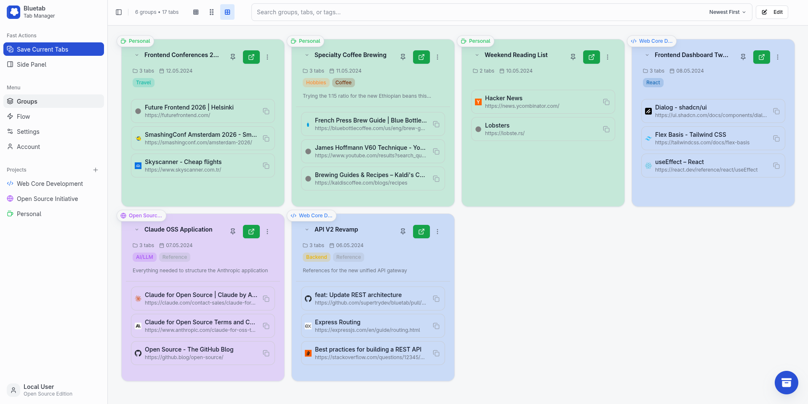
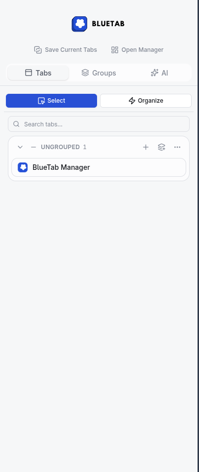

<p align="center">
  
</p>

<p align="center">
  <strong>Tame the tab chaos. Save, encrypt, search, and automate — all locally.</strong>
</p>

<p align="center">
  <a href="https://github.com/supertrydev/bluetab/blob/master/LICENSE"></a>
  <a href="https://github.com/supertrydev/bluetab/stargazers"></a>
  <a href="https://github.com/supertrydev/bluetab/releases"></a>
  
</p>

---



BlueTab is an open-source Chrome extension born from the need to organize the chaos of too many tabs. It runs **100% locally** with zero telemetry — your data never leaves your browser.

## ⚡ Quick Start



```bash
git clone https://github.com/supertrydev/bluetab.git
cd bluetab
npm install          # Install dependencies
npm run build        # Build for production
```

Then load the extension:

1. Open `chrome://extensions/`
2. Enable **Developer mode** (top-right toggle)
3. Click **Load unpacked**
4. Select the `dist/` folder

> 💡 During development, use `npm run dev` for hot-reload.

## ✨ Features

### 📁 Tab Management
- **One-click save** — Save all tabs instantly (`Alt+Shift+S`)
- **Smart restore** — Open groups in a new window or merge into current
- **Organization** — Pin, collapse, tag, and add notes to groups
- **Powerful search** — Full-text fuzzy search across 1000+ tabs in **< 50ms**
- **Bulk actions** — Select multiple groups for batch operations
- **Drag & drop** — Move tabs between groups effortlessly

### 🔒 Security
- **AES-GCM** encryption (256-bit) for sensitive tab collections
- **PBKDF2** key derivation (100,000 iterations)
- **Zero telemetry** — No analytics, no tracking, no data leaves your browser
- **Local-only storage** — Everything stays in Chrome extension storage

### 📦 Archive System
- Archive old tab groups to keep your workspace clean
- Password-protect archives with military-grade encryption
- Search through archived groups with advanced filters
- Restore archived groups anytime

### 🎨 Customization
- **Dark / Light / System** theme with smooth transitions
- **3 layout modes** — Grid, Masonry, Dashboard
- **Configurable text sizes** — Small, Medium, Large
- **Group menu customization** — Drag-and-drop to reorder menu items

### 🚀 Flow Automation *(Coming Soon)*
- URL-based auto-grouping rules
- Title pattern matching with regex
- Drag-and-drop rule priority
- Platform templates for common workflows

## 🏗️ Architecture

```text
┌─────────────────────────────────────────────────────────────────┐
│                        USER INTERFACES                          │
├──────────┬──────────┬──────────┬──────────┬───────────────────┤
│  Popup   │ Options  │ Settings │  Flow    │    Account        │
│ (Quick)  │  (Full)  │ (Config) │  (Auto)  │    (Auth)         │
└────┬─────┴────┬─────┴────┬─────┴────┬─────┴─────────┬─────────┘
     │          │          │          │               │
     └──────────┴──────────┴──────────┴───────────────┘
                              │
                              ▼
┌─────────────────────────────────────────────────────────────────┐
│                     SERVICE LAYER                               │
├─────────────────┬─────────────────┬─────────────────────────────┤
│  archive-       │  password-      │  archive-search-            │
│  service.ts     │  CRUD           │  (Search & Analytics)       │
├─────────────────┴─────────────────┴─────────────────────────────┤
│  restoration-service.ts (Smart tab restoration)                 │
├─────────────────────────────────────────────────────────────────┤
│  flow-service.ts (URL/title matching, rule execution)           │
└─────────────────────────────────────────────────────────────────┘
                              │
                              ▼
┌─────────────────────────────────────────────────────────────────┐
│                     UTILITY LAYER                               │
├────────────┬────────────┬────────────┬────────────┬────────────┤
│  storage   │  crypto    │  dedupe    │  normalize │  sorting   │
│            │  (AES-GCM) │            │  (URLs)    │            │
├────────────┴────────────┴────────────┴────────────┴────────────┤
│  auth-state.ts (encrypted token storage)                       │
│  feature-gate.ts (premium feature access control)              │
│  flow-storage.ts (Flow rules CRUD)                             │
└────────────────────────────────────────────────────────────────┘
                              │
                              ▼
┌─────────────────────────────────────────────────────────────────┐
│                     CHROME APIS                                 │
├─────────────┬─────────────┬─────────────┬─────────────────────┤
│  tabs       │  storage    │  tabGroups  │  contextMenus       │
│             │  .local     │             │                     │
└─────────────┴─────────────┴─────────────┴─────────────────────┘
```

## 🛠️ Tech Stack

| Technology | Purpose |
|---|---|
| **React 18** | UI framework |
| **TypeScript** | Type-safe development |
| **Tailwind CSS** | Utility-first styling |
| **shadcn/ui** | Accessible component library |
| **Vite** | Build tooling & HMR |
| **Web Crypto API** | AES-256 encryption |
| **Chrome Extensions API** | Browser integration |

## ⚙️ Configuration

No `.env` file needed — all settings live in Chrome extension storage.

User-configurable options in the Settings page:
- 🎨 Theme (dark / light / system)
- 🔤 Text size (small / medium / large)
- 💾 Auto-backup interval
- 🪟 Tab group restore mode (new window / current / smart)
- 📋 Group menu item ordering

## 🆚 BlueTab Core vs Cloud

BlueTab follows an **open-core model**. The core extension is 100% free and runs locally. Advanced sync and collaboration features are planned as opt-in cloud services.

| Feature | Free (OSS Core) | Cloud (Coming Soon) |
|---|:---:|:---:|
| Save & restore tabs | ✅ | ✅ |
| Full-text search | ✅ | ✅ |
| AES-256 encryption | ✅ | ✅ |
| Tags, pinning & notes | ✅ | ✅ |
| Import / Export | ✅ | ✅ |
| Archive system | ✅ | ✅ |
| Multiple layouts | ✅ | ✅ |
| **Flow automation** | ❌ | ✅ |
| **Cloud sync** | ❌ | 🔜 |

## 🤝 Contributing

<a href="https://github.com/supertrydev/bluetab/graphs/contributors">
  
</a>

<br>

Contributions are welcome! Whether it's reporting a bug, suggesting a feature, or writing code — every bit helps.

1. Fork the repository
2. Create your feature branch (`git checkout -b feature/amazing-feature`)
3. Commit your changes (`git commit -m 'Add amazing feature'`)
4. Push to the branch (`git push origin feature/amazing-feature`)
5. Open a Pull Request

## 📄 License

[MIT](LICENSE) — free for personal and commercial use.

---

<p align="center">
  Built with ❤️ by <a href="https://github.com/supertrydev">Supertry</a>
</p>
